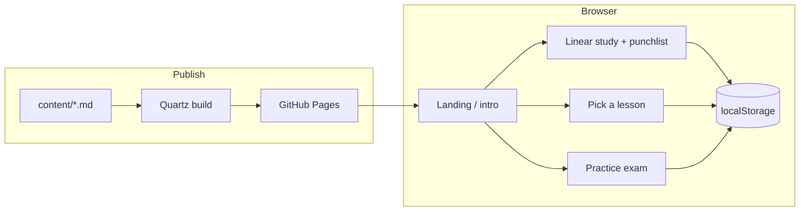

# JASYTI Internet Technology Study Platform

**CompTIA Network+ (N10-009) study guide** — knowledge base, linear study path, quizzes, and practice exam.

> **This README is the single source of truth** for how this repository is structured today, what we are building in the MVP, and how it can grow into a multi-user platform later. When you return after time away, read this file first.

---

## Table of contents

1. [Purpose](#purpose)
2. [Architecture at a glance](#architecture-at-a-glance)
3. [User journeys](#user-journeys)
4. [Grading and progress](#grading-and-progress)
5. [Repository layout — today](#repository-layout--today)
6. [Repository layout — MVP target](#repository-layout--mvp-target)
7. [Repository layout — future (multi-platform)](#repository-layout--future-multi-platform)
8. [Core data contracts](#core-data-contracts)
9. [Design rules (do not break these)](#design-rules-do-not-break-these)
10. [Implementation roadmap](#implementation-roadmap)
11. [Daily workflow](#daily-workflow)
12. [Build and deploy](#build-and-deploy)
13. [Acknowledgements](#acknowledgements)

---

## Purpose

This site helps you **prepare for CompTIA Network+** by combining:

| Layer | Role |
|-------|------|
| **Lessons** | Markdown knowledge base (read, search, wiki-links, glossary) |
| **Mini quizzes** | Pass/fail checks after modules |
| **Practice exam** | Full-length exam with percentage score and domain breakdown |
| **Study path** | Optional linear punchlist (visit lessons → pass quizzes → exam) |

**Pedagogy:** [JASYTI Principle](content/00-welcome/2-how-this-site-works.md) — core ideas at the top of each page; depth below.

**MVP audience:** One learner, one PC, no login. Progress lives in the browser (`localStorage`).

**Future audience (optional):** Accounts, sync across devices, instructor dashboards — added later without throwing away content or quiz data (see [Future](#repository-layout--future-multi-platform)).

---

## Architecture at a glance

Four layers. Only layer 3 swaps when moving from solo PC to full service.

```text
┌─────────────────────────────────────────────────────────────┐
│  1. CONTENT      Markdown in content/  (lessons, welcome)   │
├─────────────────────────────────────────────────────────────┤
│  2. MANIFEST     course-manifest.json  (order, IDs, links)  │
├─────────────────────────────────────────────────────────────┤
│  3. PROGRESS     progress.js → localStorage (later: API)    │
├─────────────────────────────────────────────────────────────┤
│  4. INTERACTIVE  quiz engine, glossary, punchlist UI        │
└─────────────────────────────────────────────────────────────┘
         ▲
         │  Built and published by Quartz → GitHub Pages
         │
    quartz/ (submodule) + quartz.config.ts
```



**Stack:** [Quartz](https://quartz.jzhao.xyz/) (static site) + vanilla JS for quizzes/progress. **No backend in MVP.**

---

## User journeys

The **published home page** (not the practice exam) should introduce the site and offer three choices:

| Path | Behavior |
|------|----------|
| **Study linearly** | Follow `course-manifest.json` order: lesson → mini quiz → next lesson. Punchlist shows ✅ visited / ✅ quiz passed. |
| **Pick a lesson** | Jump to any lesson or domain index; progress still updates when pages are visited and quizzes passed. |
| **Take the exam** | Full practice exam (25 / 50 / 90 questions); results show **percentage** and **per-domain** strengths/weaknesses. |

---

## Grading and progress

| Activity | “Grade” | Stored as | MVP storage |
|----------|---------|-----------|-------------|
| Lesson | Visited page (boolean) | `lessons[id].visited` | `localStorage` |
| Mini quiz | Pass/fail (e.g. ≥ 85%) | `quizzes[id].passed` | `localStorage` |
| Practice exam | Percentage + domain stats | `exams[]` or `lastExam` | `localStorage` |

**No backend required** for MVP. A backend (or Supabase/Firebase) is only needed later for: login, multi-device sync, or instructor reporting.

**Progress module rule:** All read/write goes through `progress.js` — never scatter `localStorage` calls across random pages.

---

## Repository layout — today

What exists now (including legacy items to migrate or remove):

```text
r62-Internet-technology/
├── content/                    # ★ Author lessons here (Quartz source of truth)
│   ├── index.md                # Portal home (will become intro landing)
│   ├── 00-welcome/             # Welcome, JASYTI, glossary (glossary JS missing)
│   ├── 01-network-plus/        # Network+ course
│   │   ├── CompTIA-NetworkPlus-N10009-LearnerDocs/  # Primary lesson tree (MD + PDF)
│   │   ├── networking-concepts/  # Older MD lessons
│   │   ├── network-implamentation/  # PDFs (typo in folder name)
│   │   ├── network-operations/      # PDFs
│   │   ├── network-security/        # PDFs
│   │   ├── network-troubleshooting/ # PDFs
│   │   ├── np-roadmap.md       # MedCertify punchlist (external LMS)
│   │   └── quizzes/            # Placeholder (empty)
│   ├── 02-category-2 … 05-category-5/  # Template placeholders
│   └── 10-jukebox/             # Study songs (optional)
│
├── quartz/                     # Git submodule (Quartz v4)
├── quartz.config.ts            # Site config (update baseUrl for this repo)
├── quartz.layout.ts            # Layout (search, graph, TOC, …)
│
├── static/study/               # Quiz engine, manifest, progress (→ public/static/study)
├── scripts/                    # generate-manifest, copy-study-static, ensure-quartz-build
├── components/StudyScripts.tsx # Global progress + lesson-visit scripts
│
├── pdf-references/             # Extra reference PDFs (not in main lesson flow)
└── .github/workflows/deploy.yml  # Build on push to branch v4
```

**Known gaps today**

- Domain 1 folder in LearnerDocs has no MD lessons yet (use `networking-concepts/` or add episodes).
- Duplicate lesson trees (LearnerDocs vs older PDF/MD folders) — consolidate over time.
- Glossary has starter terms only; expand `static/study/glossary.json`.
- Confirm GitHub Pages `baseUrl` matches your fork (`jasytionline.github.io/r62-Internet-technology`).

---

## Repository layout — MVP target

Target structure after Phase 1–3 of the [roadmap](#implementation-roadmap):

```text
r62-Internet-technology/
├── content/
│   ├── index.md                      # Introduction landing (3 study choices)
│   ├── 00-welcome/
│   ├── 01-network-plus/
│   │   ├── index.md                  # Course hub
│   │   ├── study-path.md             # Punchlist UI (loads manifest + progress)
│   │   ├── quizzes/
│   │   │   ├── practice-exam.md      # Full exam page (embeds quiz app)
│   │   │   └── module-*.md           # Mini quiz pages (one per module)
│   │   └── CompTIA-NetworkPlus-N10009-LearnerDocs/   # Canonical lessons
│   └── …
│
├── quartz/static/                    # Or repo static/ copied by Quartz
│   └── study/
│       ├── course-manifest.json      # ★ Order, stable IDs, lesson/quiz links
│       ├── progress.js               # ★ Progress adapter (localStorage)
│       ├── quiz.js                   # Quiz engine (shared: mini + full)
│       ├── questions/                # JSON question banks
│       │   ├── exam.json
│       │   └── module-*.json
│       ├── glossary.json
│       ├── glossary.js
│       └── quiz.css
│
├── index.html                        # REMOVED or redirect only
├── quiz.js / questions.json          # REMOVED from root after move
│
├── quartz.config.ts                  # baseUrl = this GitHub Pages URL
└── README.md                         # ★ This file (the plan)
```

**MVP principle:** One published site. Exam and punchlist are **routes inside Quartz**, not a separate app at the repository root.

---

## Repository layout — future (multi-platform)

When (if) you add accounts and sync, **keep** content, manifest, and question JSON. **Swap** the progress adapter.

```text
                    ┌──────────────────┐
  Browser           │  progress.js     │
  (same UI)         │  adapter:        │
                    │  - LocalStore    │  ← MVP
                    │  - RemoteAPI     │  ← Future
                    └────────┬─────────┘
                             │
                    ┌────────▼─────────┐
                    │ Supabase / API   │  ← Optional Phase 4+
                    │ users, progress  │
                    └──────────────────┘
```

| Phase | Add | Content / quiz changes |
|-------|-----|-------------------------|
| **4** | Auth + cloud progress | None — same lesson IDs and manifest |
| **5** | Instructor dashboard | Read progress API; optional admin UI |
| **6** | Hardening | Server-side quiz if you need hidden answers |

You do **not** need a structural reboot if Phases 1–3 use stable IDs and `progress.js` from the start.

---

## Core data contracts

### `course-manifest.json` (planned)

Single ordered syllabus. Drives linear study and punchlist.

```json
{
  "schemaVersion": 1,
  "courseId": "comptia-network-plus-n10-009",
  "steps": [
    {
      "id": "d1-l01",
      "type": "lesson",
      "title": "Introduction to Network Communications",
      "slug": "01-network-plus/CompTIA-NetworkPlus-N10009-LearnerDocs/...",
      "domain": 1
    },
    {
      "id": "d1-q01",
      "type": "quiz",
      "title": "Domain 1 check-in",
      "questionBank": "questions/module-d1.json",
      "passPercent": 85
    }
  ]
}
```

- **`id`** — Stable forever; progress keys use this, not file paths.
- **`slug`** — Quartz path; may change with renames if you migrate IDs in progress.

### Progress object (planned, `localStorage` key e.g. `jasyti-netplus-progress`)

```json
{
  "schemaVersion": 1,
  "userId": "local",
  "lessons": { "d1-l01": { "visited": true, "visitedAt": "2026-05-19" } },
  "quizzes": { "d1-q01": { "passed": true, "bestScore": 90, "attempts": 2 } },
  "lastExam": { "score": 82, "domains": { "1": 90, "2": 75 }, "at": "2026-05-19" }
}
```

### Question bank (`static/study/questions/question-bank.json`)

Single source of truth for all quizzes. Each question includes:

| Field | Purpose |
|-------|---------|
| `id` | Stable string (e.g. `d2-l01-pre-01`) |
| `domain` | 1–5 (exam section) |
| `lessonId` | Manifest lesson id, or `null` for section-only |
| `pools` | `pre`, `post`, `section`, `exam` |
| `tags` | `fact`, `mustKnow`, `keyConcept` |
| `question`, `options`, `correct`, `explanation` | Same as legacy exam format |

- **Pre/post quizzes** — `pools` includes `pre` or `post`; IDs listed in `questions/lessons/{lessonId}.json`
- **Section quiz** — `pools` includes `section` and tags `mustKnow` or `keyConcept` for that domain
- **Practice exam** — generated `exam.json` includes every question with `exam` in `pools`

Regenerate after edits: `node scripts/build-question-bank.mjs` (also runs via `npm run manifest`).

---

## Design rules (do not break these)

1. **Edit public lessons in `content/` only** — Quartz publishes from there.
2. **Stable IDs** for lessons and quizzes in the manifest — not raw paths in progress.
3. **One progress API** — `progress.js` only; swappable storage later.
4. **One quiz engine** — mini quizzes and full exam share `quiz.js` + filtered question banks.
5. **Landing = introduction** — exam is linked, not the site root.
6. **Canonical lesson tree** — consolidate into `CompTIA-NetworkPlus-N10009-LearnerDocs/` over time.
7. **Do not edit `quartz/` submodule** unless upgrading Quartz — config lives in `quartz.config.ts` at repo root.

**Anti-patterns (cause a painful “reboot” later)**

- `localStorage` in individual markdown or ad-hoc scripts
- Hard-coding lesson order only in HTML
- Keeping two apps (root `index.html` + Quartz) as permanent architecture
- Identifying progress only by file path with no `id`

---

## Implementation roadmap

Use this checklist to see where you are. Update checkboxes as work completes.

### Phase 0 — Documentation (this file)

- [x] README as single source of truth for structure and plan

### Phase 1 — Landing and navigation

- [x] Rewrite `content/index.md` as introduction + 3 choices (linear / pick lesson / exam)
- [x] Remove root `index.html` / legacy exam files (exam lives under Quartz routes)
- [x] Fix `quartz.config.ts` `baseUrl` for this repository
- [x] Hide or mark `draft: true` on template placeholder categories (02–05, jukebox)

### Phase 2 — Unify interactive assets

- [x] Create `static/study/` (copied to `public/static/study` on build)
- [x] Move `quiz.js`, `quiz.css`, `questions/exam.json` under static study folder
- [x] Add `content/01-network-plus/quizzes/practice-exam.md` that loads the exam
- [x] Wire domain check-in page to same engine (`domain-check-in.md` + `?quiz=`)

### Phase 3 — Manifest and progress (MVP brain)

- [x] Add `course-manifest.json` with stable step IDs (generated from LearnerDocs)
- [x] Add `progress.js` with `localStorage` adapter
- [x] Add `content/01-network-plus/study-path.md` punchlist UI
- [x] Lesson pages: on load, `markVisited(lessonId)` via `lesson-visit.js` + manifest
- [x] Mini quizzes: on submit, `markQuizPassed(quizId, passed)`
- [x] Exam: save `lastExam` with domain breakdown

### Phase 4 — Reinforcement

- [x] Study lesson layout (banner, sidebar, intro / pre / learning / post)
- [x] Master question bank + lesson pre/post indexes; section quizzes; exam sync
- [ ] Add `glossary.json` + `glossary.js`; fix `content/00-welcome/9-glossary.md`
- [ ] Tag remaining questions with `lessonId` / glossary terms as lessons are converted
- [ ] Consolidate duplicate content; fix `network-implamentation` typo when safe

### Phase 5 — Polish

- [ ] Align MedCertify `np-roadmap.md` with manifest (optional cross-links)
- [ ] Local build docs verified (`git submodule update`, `npx quartz build`)
- [ ] Exam pass threshold and copy reviewed (85% mini vs 95% full — document choices in this README)

### Phase 6+ — Future (only when needed)

- [ ] Remote progress adapter (Supabase/Firebase/custom API)
- [ ] Authentication
- [ ] Multi-device sync and/or instructor dashboard

---

## Study lesson pages (work one at a time)

Each lesson in `CompTIA-NetworkPlus-N10009-LearnerDocs/` can use the **study layout**:

1. Copy [`content/01-network-plus/_templates/lesson-template.md`](content/01-network-plus/_templates/lesson-template.md) into the target domain folder.
2. Set `lessonId` (must match manifest, e.g. `d2-l01`), `domain`, and `banner`.
3. Write **Introduction**, **Learning material** (Markdown inside `#learning`), and add pre/post questions to the bank.
4. Run `npm run manifest` to refresh manifest + `exam.json`.
5. Preview with `npm run serve` — pilot example: `network-implementation-1-1-1-static-routing.md`.

**Chrome:** top banner, left sidebar (Home → lessons in domain → final exam), top nav (Home | Section Quiz | Jukebox). Jukebox stubs live under `content/01-network-plus/jukebox/domain-N.md`.

## Daily workflow

1. Open **`content/`** in Obsidian (vault = `content/` folder).
2. Edit or add Markdown lessons; use `draft: true` until ready to publish.
3. Preview locally (see [Build and deploy](#build-and-deploy)).
4. Commit and push; GitHub Actions publishes to GitHub Pages (`main`).

**Formal coursework** (videos, labs, graded chapters) may stay in **MedCertify** — see `content/01-network-plus/np-roadmap.md`. This site is your **notes, drills, and practice exam**.

---

## Build and deploy

### Prerequisites

```bash
git submodule update --init --recursive
cd quartz && npm ci && cd ..
```

### Local preview

```bash
npm install
cd quartz && npm ci && cd ..
npm run build
npm run serve
```

Site output is `public/`. Open the URL printed by the dev server (usually port 8080).

### Publish

- Push to branch **`v4`** → `.github/workflows/deploy.yml` builds and deploys to GitHub Pages.
- Site URL pattern: `https://<github-username>.github.io/r62-Internet-technology/` (confirm in repo Settings → Pages).

### First-time GitHub Pages

1. Repository **Settings → Pages → Build and deployment → Source: GitHub Actions**.
2. Ensure the `quartz` submodule is committed and populated after clone.

### What you should edit vs avoid

| Edit freely | Change only with intent |
|-------------|-------------------------|
| `content/**/*.md` | `quartz.config.ts`, `quartz.layout.ts` |
| `quartz/static/study/*` (once created) | `quartz/` submodule (upgrade separately) |
| This `README.md` (keep plan current) | `.github/workflows/` |

---

## Acknowledgements

- Original knowledge-base template: [@sosiristseng](https://github.com/sosiristseng)
- Static site generator: [Quartz](https://quartz.jzhao.xyz/) ([jackyzha0/quartz](https://github.com/jackyzha0/quartz) submodule)

## License

[MIT License](https://opensource.org/licenses/MIT)

---

*Last updated: 2026-05-19 — Update this date when you change architecture or complete roadmap phases.*
